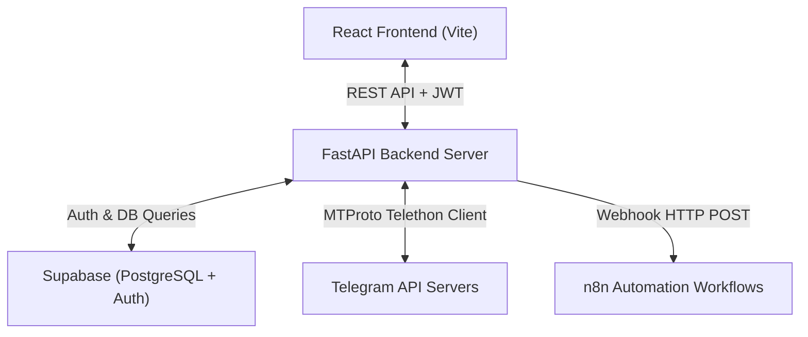

# ⚡ TelegramSync Studio — Multi-User Live Telegram Sync & Relay Engine

A powerful, multi-tenant platform for extracting, transforming, filtering, and auto-relay posting Telegram channel messages in real-time. Powered by **FastAPI**, **Telethon MTProto**, **Supabase Auth & Database**, and **Vite + React**.

---

## 🌟 Overview & Key Features

TelegramSync Studio enables creators, community managers, and automation builders to mirror and modify content across Telegram channels instantly.

### Core Capabilities:

- 🔐 **Multi-User Authentication**: Individual user accounts powered by Supabase Auth with JWT bearer token verification.
- 📱 **Multi-Tenant MTProto Connection**: Connect user Telegram accounts securely via Telethon `StringSession` strings with multi-device conflict resolution.
- 🎛️ **Side-by-Side Sync Studio**: Real-time 3-column view:
  1. **Source Stream (Extract)**: Real-time incoming chat feed from source channels.
  2. **Live Modifier Engine**: Instant rule execution (Text Prefix/Suffix, Multiple Find & Replace, Quick Bulk Replacement, Link Stripping/Overriding, Image Override/Stripping, Keyword Filters).
  3. **Destination Stream (Paste/Relay)**: Live feed of auto-posted messages in target channels.
- 💬 **Dual Reply Engine**:
  - **Native Telegram Replies**: Automatically links parent-child reply chains in target channels.
  - **Smart Quote Fallback**: Intelligently appends styled quote headers (`↪ Replying to User: "..."`) when parent messages are unlinked or posted prior to bot mapping.
- 🖼️ **Full Media Support**: Seamlessly forwards Videos, Photos, Documents, GIFs, and Audio with option to strip or override media banners.
- 🔄 **n8n Webhook Integration**: Auto-post transformed messages to external n8n workflows per user.
- 👑 **Subscription Tier Management**: Built-in support for Free Tier, Basic Plan (₹599), and Pro Plan (₹799) with Razorpay integration support.

---

## 🏗️ Architecture & Technology Stack



### Stack Breakdown:
- **Frontend**: React 18, Vite 8, Vanilla CSS (Dark/Glassmorphism theme), FontAwesome Icons.
- **Backend**: Python 3.12, FastAPI, Uvicorn, Telethon (MTProto Client).
- **Database & Auth**: Supabase PostgreSQL, Row Level Security (RLS), Supabase Auth.
- **Deployment**: Docker containerized backend, Nginx reverse proxy, PM2 process management.

---

## 📁 Repository Structure

```text
telegram-sync/
├── backend/
│   ├── main.py               # FastAPI application & REST API endpoints
│   ├── telegram_manager.py   # Central MTProto session manager & message listener
│   ├── supabase_client.py   # Supabase DB operations & JWT auth middleware
│   ├── config.py             # Environment configurations & defaults
│   ├── Dockerfile             # Production container definition
│   └── requirements.txt      # Python dependencies
├── frontend/
│   ├── src/
│   │   ├── components/
│   │   │   ├── StudioTab.jsx      # Side-by-Side Sync Studio tab
│   │   │   ├── OverviewTab.jsx    # Stats & real-time analytics tab
│   │   │   ├── ChannelsTab.jsx    # Channel matrix & dialog inspector
│   │   │   ├── PricingTab.jsx     # Subscription plans tab
│   │   │   ├── Header.jsx         # Top navigation header
│   │   │   ├── Sidebar.jsx        # Navigation sidebar
│   │   │   └── AuthModal.jsx      # Telegram login & OTP verification modal
│   │   ├── App.jsx            # Main App state & polling engine
│   │   ├── index.css          # Design system & dark glassmorphism styles
│   │   └── main.jsx           # Entrypoint
│   ├── package.json
│   └── vite.config.js
├── supabase/
│   └── schema.sql             # PostgreSQL DDL schema & RLS policies
├── DEPLOYMENT.md              # Production VPS deployment guide
└── README.md                  # Project documentation
```

---

## ⚡ Quick Start Guide

### 1. Database Setup (Supabase)

1. Create a project at [supabase.com](https://supabase.com).
2. Open the **SQL Editor** in your Supabase Dashboard.
3. Paste and run `supabase/schema.sql` to create `profiles`, `user_settings`, `sync_logs`, and `subscriptions` tables.

### 2. Environment Setup

Create `backend/.env` file:

```env
TELEGRAM_API_ID=12345667
TELEGRAM_API_HASH=aaaaaa88uaa99a9a9a0
SUPABASE_URL=https://your-project.supabase.co
SUPABASE_ANON_KEY=your-anon-key
SUPABASE_SERVICE_ROLE_KEY=your-service-role-key
SUPABASE_JWT_SECRET=your-jwt-secret
```

Create `frontend/.env` file:

```env
VITE_SUPABASE_URL=https://your-project.supabase.co
VITE_SUPABASE_ANON_KEY=your-anon-key
VITE_BACKEND_URL=http://localhost:8000
```

### 3. Local Development

#### Start Backend:
```bash
cd backend
pip install -r requirements.txt
python main.py
```
*(Runs on `http://localhost:8000`)*

#### Start Frontend:
```bash
cd frontend
npm install
npm run dev
```
*(Runs on `http://localhost:5173`)*

---

## 🐳 Docker Deployment

To deploy the backend on a Linux VPS server using Docker:

```bash
cd backend
docker build -t telegram-sync-backend .
docker run -d \
  --name telegram-sync-backend \
  --restart always \
  -p 8003:8000 \
  --env-file .env \
  telegram-sync-backend
```

Refer to [DEPLOYMENT.md](file:///c:/Users/shwet/OneDrive/Documents/GitHub/telegram-sync/DEPLOYMENT.md) for full Nginx reverse proxy and HTTPS configuration.

---

## 🔒 Security & Data Privacy

- **Row Level Security (RLS)**: Enforced across all Supabase database tables. Users can only access their own settings and logs.
- **Session Protection**: Encrypted `StringSession` strings stored securely in user profiles. Auto-invalidates revoked or duplicate IP sessions cleanly.
- **Token Verification**: Protected endpoints verify JWT signatures issued by Supabase Auth.

---

## 📄 License

This project is licensed under the MIT License.
